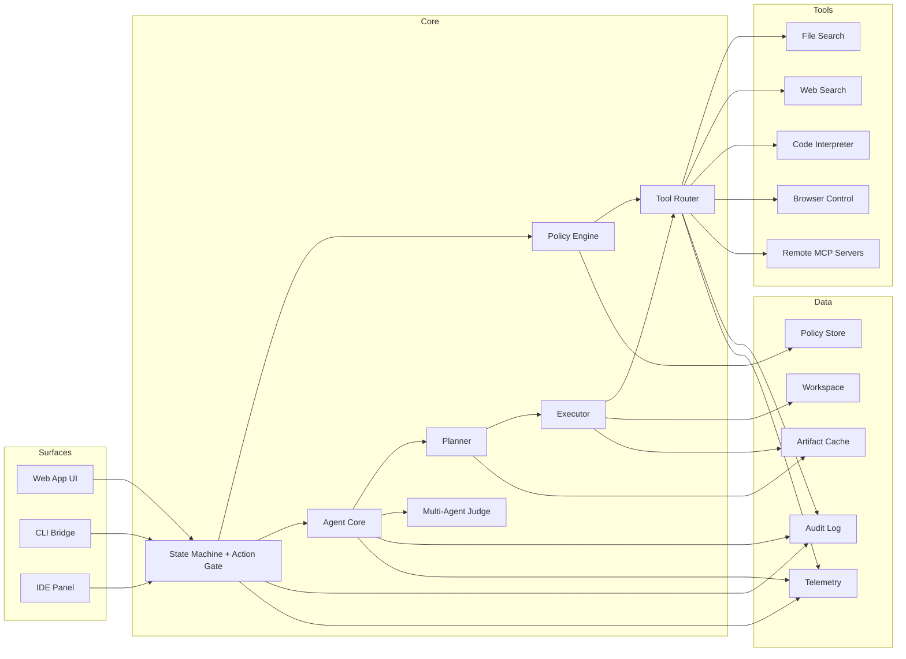
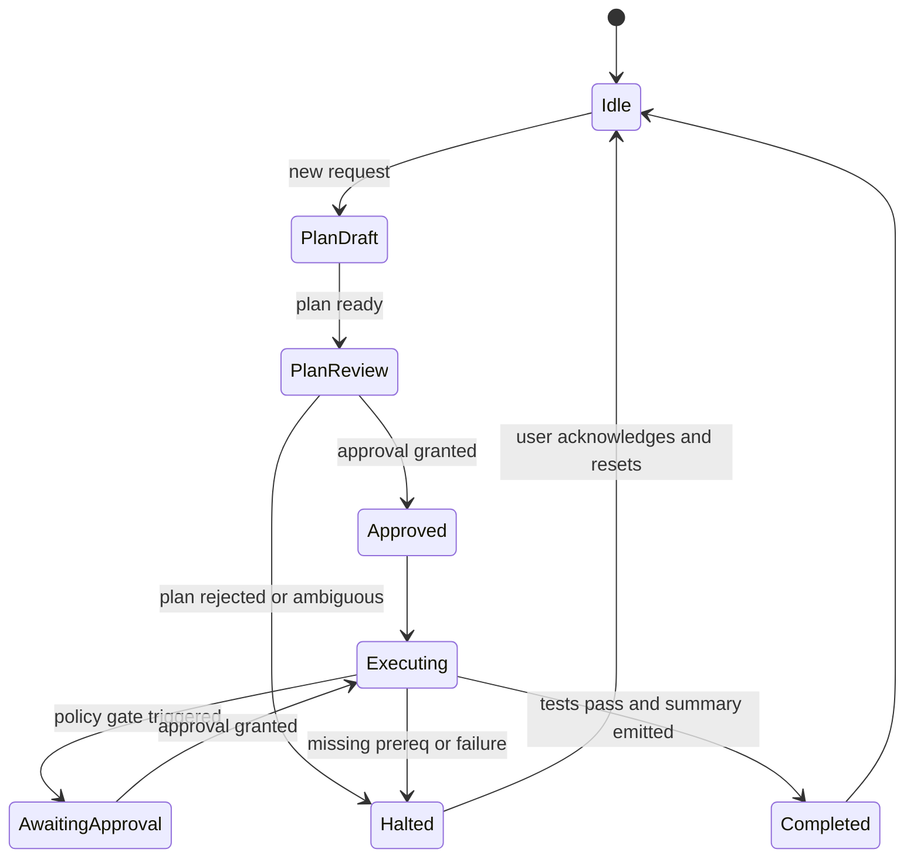

# Monolith Agent OS Architecture

Date: 2025-12-29

## 1) High-Level Overview
The system is a single product with multiple surfaces (web app, CLI bridge, IDE panel) that all route through the same policy gate, agent core, and tool execution fabric. The state machine determines which actions can be expressed at any moment.

## 2) System Diagram (Mermaid)

## 3) State Machine (Mermaid)

## 4) Module Responsibilities
- State Machine + Action Gate: renders only valid actions; blocks unsafe actions by construction.
- Policy Engine: evaluates allow/deny/ask rules per tool, scope, and action.
- Planner: produces a structured plan with explicit prerequisites and validation steps.
- Executor: performs edits and commands inside a scoped workspace.
- Multi-Agent Judge: runs parallel variants and selects best output.
- Tool Router: enforces schema validation and routes tool calls.
- Audit Log: immutable ledger of plans, approvals, commands, diffs, and outcomes.

## 5) Data and Storage
- Workspace: source code and files (read/write within scope only).
- Policy Store: org rules, per-repo constraints, allowlists.
- Audit Log: append-only record for compliance.
- Telemetry: performance metrics, error rates, and policy outcomes.
- Artifact Cache: plans, patches, test results, and reports.

## 6) Security Boundaries
- Tool calls cannot bypass Policy Engine.
- Executor runs in a constrained workspace scope.
- Any cross-boundary action requires explicit policy approval.

## 7) Failure and Halt Behavior
- Ambiguity, missing prerequisites, or test failures trigger Halted state.
- Halted state exposes a single safe next action: resolve or exit.
- No partial side effects are applied without explicit state transition.

## 8) Deployment Topology
- Single web UI + local bridge for filesystem access.
- Optional cloud agent workers for long-running tasks.
- Optional MCP connectors for external data sources.
